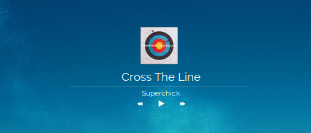
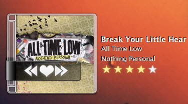
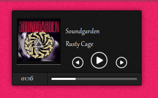

# Platter

<p></p>
<table><tr>
<td></td>
<td></td>
</tr></table>

**The album art of whatever you're playing, living right there on your desktop.**

Ten-odd years ago there was a little Linux app called **CoverGloobus**, and it
was wonderful: your desktop wallpaper, quietly decorated with whatever song
was playing, dressed up in one of hundreds of skins people made just because
they felt like it. Then it vanished. Platter brings it back for GNOME Shell —
same idea, same spirit, a whole shelf of those old skins restored and ready to
wear.

**[→ Come look at the themes](https://sandbranch.github.io/platter-gnome-shell-extension/#themes)**

## Get it

From extensions.gnome.org, or straight from this repo:

```
make install
```

Log out and back in once — GNOME Shell needs a fresh session to notice new
extensions, and everyone forgets this exactly one time.

Needs GNOME Shell 48, 49, or 50.

## Pick a look

Open **Preferences**, pick a theme, and it's on your desktop. That's the whole
interaction — no config files, no restart.

Got an old CoverGloobus or NowPlaying skin sitting around from way back? Feed
it to Platter and it just works: **Preferences → Theme → Add a theme**, point
it at the file, done. Whatever it looked like then is what it looks like now.

Platter ships with **49 themes**, and the [full gallery is on the
website](https://sandbranch.github.io/platter-gnome-shell-extension/#themes)
— go look before you go hunting for more, there's a good chance your favourite
one from a decade ago is already sitting in there. Everything else this
project has tracked down — 76 more skins, most of them still alive on the
DeviantArt pages people posted them to years ago — is credited in
[docs/credits.md](docs/credits.md), along with the honest explanation of why
not every last one of them made it into the box.

## Make your own

A theme is nothing more than a folder: a `theme.json` describing where things
go, and a handful of pictures. No build tools, no compiling, nothing to
install — drop the folder in `~/.local/share/platter/themes/` and it shows up.

[docs/making-themes.md](docs/making-themes.md) walks through building one from
nothing, with a worked example. `gloobus-plain-simple` and `platter-anno` are
both real shipped themes built entirely by hand, so either is a fine one to
copy and start messing with.

## Licence

The extension itself is **GPL-2.0-or-later** — see [LICENSE](LICENSE).

The themes are each their own author's work, under whatever terms that person
actually set. The full, honest accounting is in
[docs/credits.md](docs/credits.md). If one of them is yours and you'd rather
it weren't here, open an issue and it's gone that day.
