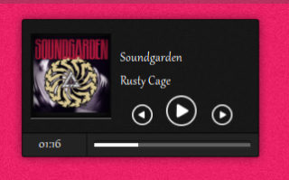
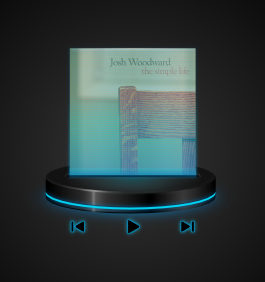
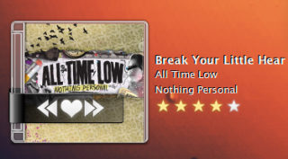
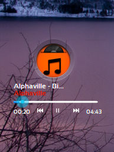
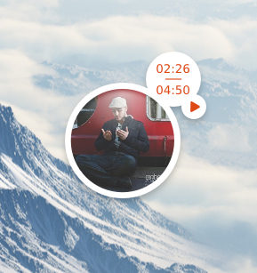
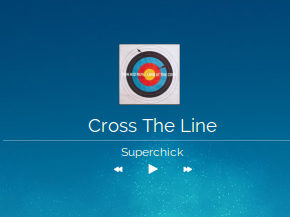
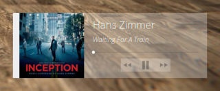
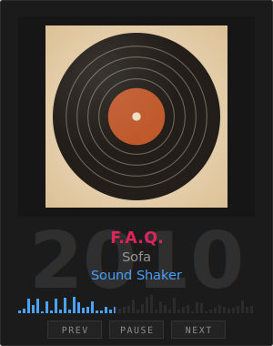

# Platter

A GNOME Shell extension that puts the album art and track info of whatever is
playing back on your desktop.

Platter brings back **CoverGloobus**, a lovely little Linux desktop widget from
2009–2012 that the Gloobus Developers built and the world mostly forgot. It
sits on your desktop behind the windows, the way the original did, follows
whatever's playing on any MPRIS2 player, and wears a different outfit for
every mood, since it draws itself from a theme instead of one fixed look.
Everything still maintained today lives cooped up in the top bar, one design,
take it or leave it. The themeable desktop widget is the thing that quietly
disappeared, and it deserved better.

The name is the turntable platter — the thing the record spins on.

## Installing

From extensions.gnome.org, or from a checkout:

```
make install
```

Then log out and back in. GNOME Shell caches extension modules for the life of
the session, so just disabling and re-enabling keeps running the old code — a
rite of passage that catches everyone exactly once.

Requires GNOME Shell 48, 49 or 50.

## Themes

<table><tr>
<td></td>
<td></td>
<td></td>
<td></td>
</tr><tr>
<td></td>
<td></td>
<td></td>
<td></td>
</tr></table>

**[→ Browse all 49 themes on the website](https://sandbranch.github.io/platter-gnome-shell-extension/#themes)**,
where a picture is worth the thousand words the credits table below is about
to spend.

Platter ships **49 of them** (47 restored, 2 written from scratch), each with
its own preview right there in the picker so you're never choosing blind off
a list of names. Full credits live down in
[Themes and credits](#themes-and-credits).

Hundreds more were made for CoverGloobus at its peak, scattered across
DeviantArt, gnome-look and file hosts that don't exist anymore. 76 of those
are catalogued below too, each with a link to wherever it still lives online.
They're not bundled here — their authors either asked for less than full reuse
or never weighed in at all — but nothing's stopping **you** from grabbing one
and converting it yourself in about the time it takes to read this sentence.

**Preferences → Theme → Add a theme → Folder… or Archive…**

Point it at the theme exactly as you downloaded it. Platter reads CoverGloobus
and NowPlaying `skin.xml` themes, unpacks archives, handles packs containing
several themes at once, and installs the result to
`~/.local/share/platter/themes`. There is a command-line equivalent if you
prefer:

```
extension/tools/platter-port ~/Downloads/some-theme.zip
extension/tools/platter-port --list
extension/tools/platter-port --verify ~/.local/share/platter/themes
```

Both run the same converter. If you keep a collection of themes somewhere else
— a synced folder, an external disk — name it as the **extra theme directory**
in preferences and Platter will read them where they sit, without copying
anything.

### What conversion actually does

The converter plays by the same rules CoverGloobus 1.7's parser actually
followed, not what its documentation claimed — the two don't agree, and every
theme out there was tested against the parser, typos and all. So it quietly
fixes the misspellings the corpus is riddled with, measures a missing width or
height straight off the asset the way 1.7 did, and leaves a `port.json` beside
every theme confessing exactly what it patched, what it measured, what it had
to guess at, and what it just couldn't bring along.

Nothing gets lost silently. If a theme looks off, `port.json` is where it
already told you why.

Bundled fonts are never copied, whatever a theme's licence says — a font
shipping inside a theme is not evidence its author had the right to ship it.
`theme.json` names the families a theme wants so you can install them yourself;
[docs/fonts.md](docs/fonts.md) sets out the reasoning and lists where to get
each one that's actually free to install.

## Themes and credits

**125 themes by 43 people**, dug up from DeviantArt, gnome-look, old source
tarballs, and a few personal archives that never left anyone's hard drive
until now. **49 of them ship with Platter**, marked ✔ below — but every single
one gets a link back to wherever it still lives, shipped or not, because
somebody made this and that's worth remembering.

None of the ones sitting on the sidelines are there because they're not good
enough — plenty are gorgeous. They're sitting out because nobody's said it's
okay yet. Turning a `skin.xml` into a Platter theme means changing it, so a
theme only joins the party here if its author signed off on both sharing it
*and* changing it. If an author asked for less than that, or never said
anything either way, we leave it be — quiet isn't the same as yes.

That's a limit on this repository, not on you, though. Grab any theme from its
link, convert it on your own machine, and nobody's redistributed a thing:
**Preferences → Theme → Add a theme**, and it's yours to enjoy.

These were made between roughly 2009 and 2012 by people posting skins purely
because it was fun to do. Some of those pages haven't had a visitor in years.
Where a theme is good — and honestly, a lot of them still are — the link
beside it is the only thank-you this project has left to give its author.

### The people who made them

<details>
<summary><b>All 43</b>, and how many themes each is credited with</summary>

[73ll0](https://www.deviantart.com/www) (2) · [Aaron (awhite92)](https://www.deviantart.com/www) (1) · [aaron-a-arts](https://www.deviantart.com/www) (3) · alespana (1) · [Alex Almeida (arcanamoon)](https://www.deviantart.com/www) (7) · [alezzacreative (MUSTAPHA ASBBAR)](https://www.deviantart.com/www) (7) · [Algalord-Gnome](https://www.deviantart.com/www) (1) · [artbhatta](https://www.deviantart.com/www) (1) · [arturoilhuitemoc (Ihuitemoc)](https://www.deviantart.com/www) (1) · cowanh00 (modification); NowPlaying screenlet by magicrobomonkey, extended by vrunner (1) · [d0od](https://www.deviantart.com/www) (1) · [d0od + Kshegyaj](https://www.deviantart.com/www) (4) · DJD (DJDP) (1) · [gabriela2400](https://www.deviantart.com/www) (8) · Giorgi "DrAcid" Maghlakelidze (1) · idroy (2) · [jivebs](https://www.deviantart.com/www) (5) · Jordi Puigdellivol Hernandez (BadChoice) (3) · kzkggaara (1) · [larryni](https://www.deviantart.com/www) (3) · Laurent Baumann (1) · [leonardomdq](https://www.deviantart.com/www) (10) · [liliumcruentus](https://www.deviantart.com/www) (3) · [Nerten](https://www.deviantart.com/www) (1) · NowPlaying screenlet (magicrobomonkey, vrunner) (14) · noyth (1) · [orsobasso](https://www.deviantart.com/www) (1) · paran0idx (3) · Platter (2) · [rabra](https://www.deviantart.com/www) (1) · raizon1 (1) · [rikarud0](https://www.deviantart.com/www) (1) · [scherezada](https://www.deviantart.com/www) (1) · slaytanicdude (1) · sosoinlove (2) · [speedracker (uploader)](https://www.deviantart.com/www) (1) · [taylantatli](https://www.deviantart.com/www) (1) · [theconso](https://www.deviantart.com/www) (3) · Theconso (1) · tiz-huglife (1) · [Twentyeight-Ten](https://www.deviantart.com/www) (2) · [xegi90](https://www.deviantart.com/www) (3) · Author unrecorded (16)

</details>

<details>
<summary><b>All 125 themes</b> — ✔ marks the 49 that ship with Platter</summary>

| | Theme | Author | For | Stated terms | Where it lives |
| --- | --- | --- | --- | --- | --- |
|  | Maverido 2 | 73ll0 | CoverGloobus | CC BY-NC-SA 3.0 | [link](https://www.deviantart.com/73ll0/art/Maverido-2-for-CoverGloobus-187186982) |
|  | Mirro | 73ll0 | CoverGloobus | CC BY-NC-SA 3.0 | [link](https://www.deviantart.com/73ll0/art/Mirro-for-CoverGloobus-188752328) |
|  | Suave | Aaron (awhite92) | CoverGloobus | not stated | [link](https://www.deviantart.com/awhite92/art/Suave-189835073) |
|  | eDark | aaron-a-arts | CoverGloobus | CC BY-NC-SA 3.0 | [link](https://www.deviantart.com/aaron-a-arts/art/eDark-Covergloobus-187966117) |
|  | eDark | aaron-a-arts | CoverGloobus | CC BY-NC-SA 3.0 | [link](https://www.deviantart.com/aaron-a-arts/art/eDark-Covergloobus-187966117) |
|  | eDark | aaron-a-arts | CoverGloobus | CC BY-NC-SA 3.0 | [link](https://www.deviantart.com/aaron-a-arts/art/eDark-Covergloobus-187966117) |
|  | Black Sundays | Alex Almeida (arcanamoon) | CoverGloobus | not stated | [link](https://www.deviantart.com/arcanamoon/art/Black-Sundays-for-CoverGlobus-194227432) |
|  | Teac extra small | Alex Almeida (arcanamoon) | CoverGloobus | not stated | [link](https://www.deviantart.com/arcanamoon/gallery) |
|  | Teac mini | Alex Almeida (arcanamoon) | CoverGloobus | not stated | [link](https://www.deviantart.com/arcanamoon/gallery) |
|  | Teac X-2000R black | Alex Almeida (arcanamoon) | CoverGloobus | not stated | [link](https://www.deviantart.com/arcanamoon/gallery) |
|  | Teac X-2000R silver | Alex Almeida (arcanamoon) | CoverGloobus | not stated | [link](https://www.deviantart.com/arcanamoon/gallery) |
|  | Titanium | Alex Almeida (arcanamoon) | CoverGloobus | not stated | [link](https://www.deviantart.com/arcanamoon/art/Titanium-skin-for-Covergloobus-205578482) |
|  | Tungsten | Alex Almeida (arcanamoon) | CoverGloobus | not stated | [link](https://www.deviantart.com/arcanamoon/art/Tungsten-skin-for-Covergloobus-207356214) |
| ✔ | DRK | alezzacreative (MUSTAPHA ASBBAR) | CoverGloobus | attribution-required | [link](https://www.deviantart.com/alezzacreative/art/DRK-CoverGloobus-skin-311869412) |
| ✔ | Glassy | alezzacreative (MUSTAPHA ASBBAR) | CoverGloobus | attribution-required | [link](https://www.deviantart.com/alezzacreative/art/Glassy-CoverGloobus-skin-310790223) |
| ✔ | Holo | alezzacreative (MUSTAPHA ASBBAR) | CoverGloobus | attribution-required | [link](https://www.deviantart.com/alezzacreative/art/Holo-CoverGloobus-skin-313902523) |
| ✔ | ICS 1 | alezzacreative (MUSTAPHA ASBBAR) | CoverGloobus | attribution-required | [link](https://www.deviantart.com/alezzacreative/art/ANDROID-ICE-CREAM-SANDWICH-CoverGloobus-skin-319457843) |
| ✔ | ICS 2 | alezzacreative (MUSTAPHA ASBBAR) | CoverGloobus | attribution-required | [link](https://www.deviantart.com/alezzacreative/art/ANDROID-ICE-CREAM-SANDWICH-CoverGloobus-skin-319457843) |
| ✔ | Bulles | alezzacreative (MUSTAPHA ASBBAR) | CoverGloobus | attribution-required | [link](https://www.deviantart.com/alezzacreative/art/Bulles-Covergloobus-skin-312555790) |
|  | Sticky | alezzacreative (MUSTAPHA ASBBAR) | CoverGloobus | not stated | [link](https://www.deviantart.com/alezzacreative/art/Sticky-Covergloobus-skin-311647361) |
| ✔ | mH1 | raizon1 (edit of alezzacreative/MUSTAPHA ASBBAR's ICS 2) | CoverGloobus | attribution-required | [link](https://www.deviantart.com/raizon1/) |
|  | dirty-compact | Algalord-Gnome | CoverGloobus | CC BY-NC-SA 3.0 | [link](https://www.deviantart.com/algalord-gnome/art/Dirty-compact-for-covergloobus-161054544) |
|  | bhattaGloobus | artbhatta | CoverGloobus | all rights reserved | [link](https://www.deviantart.com/artbhatta/art/bhattaGloobus-covergloobus-theme-405044212) |
| ✔ | Faenza Alternate | arturoilhuitemoc (Ihuitemoc) | CoverGloobus | CC BY-SA 3.0 | [link](https://www.deviantart.com/arturoilhuitemoc/art/Faenza-Alternate-CoverGloobus-197373411) |
| ✔ | Faenza Revisited | alespana (edit of arturoilhuitemoc/Ihuitemoc's Faenza Alternate) | CoverGloobus | CC BY-SA 3.0 | [link](https://www.deviantart.com/alespana/) |
| ✔ | simpleOne_v2 | cowanh00 (modification); NowPlaying screenlet by magicrobomonkey, extended by vrunner | NowPlaying | GPL-2.0-or-later | [link](https://web.archive.org/web/2015/http://www.gnome-look.org/CONTENT/content-files/77435-NowPlaying.tar.gz) |
|  | Faenzoobus pointoo | d0od | CoverGloobus | all rights reserved | [link](https://www.deviantart.com/d0od/art/Faenza-CoverGloobus-Theme-2-176871146) |
|  | Faenzoobus Dark | idroy (remix of d0od's Faenzoobus, using thieum's Faenza icon set and BigRZA's ToolTip2 seek-bar button) | CoverGloobus | CC BY-NC-SA 3.0 | [link](https://www.deviantart.com/idroy/art/Faenza-CovergloobusTheme-Remix-255445460) |
|  | Faenzoobus Light | idroy (remix of d0od's Faenzoobus, using thieum's Faenza icon set and BigRZA's ToolTip2 seek-bar button) | CoverGloobus | CC BY-NC-SA 3.0 | [link](https://www.deviantart.com/idroy/art/Faenza-CovergloobusTheme-Remix-255445460) |
| ✔ | Box Of Tricks by d0od | d0od + Kshegyaj | CoverGloobus | attribution-required | [link](https://launchpad.net/covergloobus) |
| ✔ | Box Of Tricks Mod By d0od | d0od + Kshegyaj | CoverGloobus | attribution-required | [link](https://launchpad.net/covergloobus) |
| ✔ | Box Of Tricks Mod By d0od | d0od + Kshegyaj | CoverGloobus | attribution-required | [link](https://web.archive.org/web/2015/http://www.gnome-look.org/CONTENT/content-files/113049-Box%20Of%20Tricks%20&%20Mod.tar.gz) |
| ✔ | Shiki CD Case 1.2 | d0od + Kshegyaj | CoverGloobus | attribution-required | [link](https://www.deviantart.com/vicing/art/Shiki-CD-Case-for-covergloobus-155864031) |
|  | iSticky | DJD (DJDP) | NowPlaying | no-derivatives, credit required | [link](https://launchpad.net/covergloobus) |
|  | Blue Star | gabriela2400 | CoverGloobus | not stated | — |
|  | Florence | gabriela2400 | CoverGloobus | all rights reserved | [link](https://www.deviantart.com/gabriela2400/art/Florence-for-covergloobus-166227140) |
|  | GAIA 10 Rdio | gabriela2400 | CoverGloobus | all rights reserved | [link](https://www.deviantart.com/gabriela2400/art/Gaia-Rdio-for-Covergloobus-183425403) |
| ✔ | Lunatic | gabriela2400 | CoverGloobus | attribution-required | [link](https://www.deviantart.com/gabriela2400/art/Lunatic-for-Covergloobus-158037835) |
|  | mardy bum | gabriela2400 | CoverGloobus | not stated | [link](https://www.deviantart.com/gabriela2400/art/Mardy-Bum-for-Covergloobus-156752105) |
|  | PaintOnTheWall | gabriela2400 | CoverGloobus | all rights reserved | [link](https://www.deviantart.com/gabriela2400/art/Kingdom-of-Rust-for-CGloobus-156453171) |
|  | WildHorses | gabriela2400 | CoverGloobus | all rights reserved | [link](https://www.deviantart.com/gabriela2400/art/Wild-Horses-for-Covergloobus-156650766) |
|  | MCF | gabriela2400 | CoverGloobus | all rights reserved | [link](https://www.deviantart.com/gabriela2400/art/MCF-for-covergloobus-180422681) |
|  | ecg | jivebs | CoverGloobus | all rights reserved | [link](https://www.deviantart.com/jivebs/art/covergloobus-theme-v-1-389883131) |
|  | ecg small | jivebs | CoverGloobus | all rights reserved | [link](https://www.deviantart.com/jivebs/art/covergloobus-theme-v-1-389883131) |
|  | ecg small | jivebs | CoverGloobus | all rights reserved | [link](https://www.deviantart.com/jivebs/art/covergloobus-theme-v-1-389883131) |
|  | ecg with slider | jivebs | CoverGloobus | all rights reserved | [link](https://www.deviantart.com/jivebs/art/covergloobus-theme-v-1-389883131) |
| ✔ | Cross The Line | jivebs | CoverGloobus | CC BY 3.0 | [link](https://www.deviantart.com/jivebs/art/Cross-The-Line-400125059) |
| ✔ | BadChoice | Jordi Puigdellivol Hernandez (BadChoice) | CoverGloobus | GPL-3.0 | [link](https://launchpad.net/covergloobus) |
| ✔ | BadChoice | Jordi Puigdellivol Hernandez (BadChoice) | CoverGloobus | GPL-3.0 | [link](https://github.com/deepin-espanol/covergloobus) |
| ✔ | BadChoice | Jordi Puigdellivol Hernandez (BadChoice) | CoverGloobus | GPL-3.0 | [link](https://github.com/deepin-espanol/covergloobus) |
|  | Big Button | larryni | CoverGloobus | CC BY-NC-SA 3.0 | [link](https://www.deviantart.com/larryni/art/Big-Button-for-CoverGloobus-186687880) |
|  | Big Button (plain) | larryni | CoverGloobus | CC BY-NC-SA 3.0 | [link](https://www.deviantart.com/larryni/art/Big-Button-for-CoverGloobus-186687880) |
|  | Monocle | larryni | CoverGloobus | CC BY-NC-SA 3.0 | [link](https://www.deviantart.com/larryni/art/Monocle-for-CoverGloobus-188309629) |
|  | Vinyl | Laurent Baumann | NowPlaying | CC BY-NC-SA 3.0 | [link](https://launchpad.net/covergloobus) |
|  | Bad Romance | leonardomdq | CoverGloobus | all rights reserved | [link](https://www.deviantart.com/leonardomdq/art/Bad-Romance-for-Covergloobus-158164088) |
|  | Elegante | leonardomdq | NowPlaying | all rights reserved | [link](https://www.deviantart.com/leonardomdq/art/Elegante-Skin-for-Covergloobus-157735702) |
|  | Jet LP port by leonardomdq | leonardomdq | CoverGloobus | all rights reserved | [link](https://www.deviantart.com/leonardomdq/art/Jet-LP-for-Covergloobus-162591457) |
|  | Lighting | leonardomdq | CoverGloobus | all rights reserved | [link](https://www.deviantart.com/leonardomdq/art/Lighting-Skin-for-Covergloobus-157599685) |
|  | Long Play | leonardomdq | CoverGloobus | CC BY-NC 3.0 | [link](https://www.deviantart.com/leonardomdq/art/Long-Play-for-Covergloobus-161473582) |
|  | Maebow port by leonardomdq | leonardomdq | CoverGloobus | CC BY-NC-ND 3.0 | [link](https://www.deviantart.com/leonardomdq/art/Maebow-for-Covergloobus-162082420) |
|  | Micro | leonardomdq | CoverGloobus | not stated | [link](https://www.deviantart.com/leonardomdq/art/Micro-for-Covergloobus-161281834) |
|  | Plastico port by leonardomdq | leonardomdq | CoverGloobus | not stated | [link](https://www.deviantart.com/leonardomdq/art/Plastico-for-Covergloobus-161905982) |
|  | SnowCover Pro | leonardomdq | CoverGloobus | not stated | [link](https://www.deviantart.com/leonardomdq/art/SnowCover-Pro-for-Covergloobus-162264528) |
|  | twquet port by leonardomdq | leonardomdq | CoverGloobus | CC BY-NC-ND 3.0 | [link](https://www.deviantart.com/leonardomdq/art/Twquet-for-Covergloobus-162053013) |
|  | HeadCD | liliumcruentus | CoverGloobus | CC BY-NC-SA 3.0 | [link](https://www.deviantart.com/liliumcruentus/art/HeadCD-for-Covergloobus-172919353) |
|  | Optic | liliumcruentus | CoverGloobus | CC BY-NC-ND 3.0 | [link](https://www.deviantart.com/liliumcruentus/art/Optic-for-Covergloobus-172289315) |
|  | Medusa | liliumcruentus | CoverGloobus | CC BY-NC-SA 3.0 | [link](https://www.deviantart.com/liliumcruentus/art/Medusa-for-Covergloobus-172211335) |
|  | Old Vinyl | Nerten | CoverGloobus | not stated | [link](https://www.deviantart.com/nerten/art/Old-Vinyl-148222493) |
| ✔ | Glass | noyth | CoverGloobus | CC BY-SA 3.0 | [link](https://www.deviantart.com/noyth/art/Glass-CoverGloobus-Theme-320540395) |
| ✔ | aeroplay | NowPlaying screenlet (magicrobomonkey, vrunner) | NowPlaying | GPL-2.0-or-later | [link](https://web.archive.org/web/2011/http://www.gnome-look.org/CONTENT/content-files/69988-NowPlaying.tar.bz2) |
| ✔ | GSM DP | NowPlaying screenlet (magicrobomonkey, vrunner) | NowPlaying | GPL-2.0-or-later | [link](https://web.archive.org/web/2011/http://www.gnome-look.org/CONTENT/content-files/69988-NowPlaying.tar.bz2) |
| ✔ | GSM DP | NowPlaying screenlet (magicrobomonkey, vrunner) | NowPlaying | GPL-2.0-or-later | [link](https://web.archive.org/web/2015/http://www.gnome-look.org/CONTENT/content-files/77435-NowPlaying.tar.gz) |
| ✔ | H-K-nowplaying | NowPlaying screenlet (magicrobomonkey, vrunner) | NowPlaying | GPL-2.0-or-later | [link](https://web.archive.org/web/2011/http://www.gnome-look.org/CONTENT/content-files/69988-NowPlaying.tar.bz2) |
| ✔ | iPod DP | NowPlaying screenlet (magicrobomonkey, vrunner) | NowPlaying | GPL-2.0-or-later | [link](https://web.archive.org/web/2011/http://www.gnome-look.org/CONTENT/content-files/69988-NowPlaying.tar.bz2) |
| ✔ | Lucid-dark | NowPlaying screenlet (magicrobomonkey, vrunner) | NowPlaying | GPL-2.0-or-later | [link](https://web.archive.org/web/2011/http://www.gnome-look.org/CONTENT/content-files/69988-NowPlaying.tar.bz2) |
| ✔ | Lucid-light | NowPlaying screenlet (magicrobomonkey, vrunner) | NowPlaying | GPL-2.0-or-later | [link](https://web.archive.org/web/2011/http://www.gnome-look.org/CONTENT/content-files/69988-NowPlaying.tar.bz2) |
| ✔ | NowPlaying Default | NowPlaying screenlet (magicrobomonkey, vrunner) | NowPlaying | GPL-2.0-or-later | [link](https://web.archive.org/web/2011/http://www.gnome-look.org/CONTENT/content-files/69988-NowPlaying.tar.bz2) |
| ✔ | Orbital | NowPlaying screenlet (magicrobomonkey, vrunner) | NowPlaying | GPL-2.0-or-later | [link](https://web.archive.org/web/2011/http://www.gnome-look.org/CONTENT/content-files/69988-NowPlaying.tar.bz2) |
| ✔ | Reflective Black | NowPlaying screenlet (magicrobomonkey, vrunner) | NowPlaying | GPL-2.0-or-later | [link](https://web.archive.org/web/2011/http://www.gnome-look.org/CONTENT/content-files/69988-NowPlaying.tar.bz2) |
| ✔ | simpleOne-dark | NowPlaying screenlet (magicrobomonkey, vrunner) | NowPlaying | GPL-2.0-or-later | [link](https://web.archive.org/web/2011/http://www.gnome-look.org/CONTENT/content-files/69988-NowPlaying.tar.bz2) |
| ✔ | simpleOne_v2 | NowPlaying screenlet (magicrobomonkey, vrunner) | NowPlaying | GPL-2.0-or-later | [link](https://web.archive.org/web/2011/http://www.gnome-look.org/CONTENT/content-files/69988-NowPlaying.tar.bz2) |
| ✔ | simpleOne_v2 | NowPlaying screenlet (magicrobomonkey, vrunner) | NowPlaying | GPL-2.0-or-later | [link](https://web.archive.org/web/2011/http://www.gnome-look.org/CONTENT/content-files/69988-NowPlaying.tar.bz2) |
| ✔ | Sweeth_Bleu | NowPlaying screenlet (magicrobomonkey, vrunner) | NowPlaying | GPL-2.0-or-later | [link](https://web.archive.org/web/2011/http://www.gnome-look.org/CONTENT/content-files/69988-NowPlaying.tar.bz2) |
|  | covergloobus | orsobasso | CoverGloobus | CC BY-NC-SA 3.0 | [link](https://www.deviantart.com/orsobasso/art/Elementary-Covergloobus-1-0-not-supported-177128308) |
|  | Glass | paran0idx | CoverGloobus | CC BY-NC-SA 3.0 | [link](https://www.deviantart.com/paran0idx/art/Glass-for-CoverGloobus-173855568) |
|  | Chibi Left | paran0idx | CoverGloobus | CC BY-NC-SA 3.0 | [link](https://www.deviantart.com/paran0idx/art/Chibi-for-CoverGloobus-177538559) |
|  | Chibi Right | paran0idx | CoverGloobus | CC BY-NC-SA 3.0 | [link](https://www.deviantart.com/paran0idx/art/Chibi-for-CoverGloobus-177538559) |
| ✔ | Anno | Platter | Platter | CC0-1.0 | — |
| ✔ | Gloobus Plain & Simple | Platter | Platter | CC0-1.0 | — |
|  | BowtieGloobus Classic | rabra | CoverGloobus | all rights reserved | [link](https://www.deviantart.com/rabra/art/BowtieGloobus-Classic-162570370) |
|  | Light | rikarud0 | CoverGloobus | all rights reserved | [link](https://www.deviantart.com/rikarud0/art/RadiantLight-Covergloobus-158629423) |
|  | Run Transparent | scherezada | CoverGloobus | not stated | [link](https://www.deviantart.com/scherezada/art/Run-Transparent-158104440) |
|  | Glass Pocket | slaytanicdude | CoverGloobus | all rights reserved | [link](https://www.deviantart.com/slaytanicdude/art/Glass-pocket-for-Covergloobus-180328847) |
|  | Dot for CoverGloobus | sosoinlove | CoverGloobus | not stated | [link](https://www.deviantart.com/sosoinlove/art/Dot-for-Covergloobus-252946985) |
|  | Lifted for CoverGloobus | sosoinlove | CoverGloobus | not stated | [link](https://www.deviantart.com/sosoinlove/) |
| ✔ | Jesse | speedracker (uploader) | CoverGloobus | attribution-required | [link](https://www.deviantart.com/speedracker/art/Rustycage-New-Covergloobus-Theme-525980027) |
|  | Path | taylantatli | rainmeter | CC BY-NC-SA 3.0 | [link](https://www.deviantart.com/taylantatli/art/Path-Covergloobus-Theme-Rainmeter-Port-472383561) |
|  | Clips porting for Covergloobus by Theconso | theconso | CoverGloobus | all rights reserved | [link](https://www.deviantart.com/theconso/art/Clips-for-Covergloobus-187899434) |
|  | last.fm porting for Covergloobus by Theconso | theconso | CoverGloobus | all rights reserved | [link](https://www.deviantart.com/theconso/art/Last-fm2-for-Covegloobus-184787605) |
|  | Round for Coovergloobus by Theconso [theconso.deviantart.com]  | theconso | CoverGloobus | all rights reserved | [link](https://www.deviantart.com/theconso/art/Round-for-Covergloobus-187042320) |
|  | GrooveUp porting for Covergloobus by Theconso | Theconso | CoverGloobus | all rights reserved (author forbids reuse of the artwork without asking) | — |
|  | bitmap | Twentyeight-Ten | CoverGloobus | all rights reserved | [link](https://www.deviantart.com/twentyeight-ten/art/Bitmap-for-Covergloobus-163135772) |
|  | NEON | Twentyeight-Ten | CoverGloobus | not stated | [link](https://www.deviantart.com/twentyeight-ten/art/NEON-for-Covergloobus-159703837) |
|  | BadChoice2-Faenza | tiz-huglife | CoverGloobus | not stated | [link](https://www.deviantart.com/tiz-huglife/) |
|  | Bent Edge | xegi90 | CoverGloobus | all rights reserved | [link](https://www.deviantart.com/xegi90/art/Bent-Edge-for-CoverGloobus-179655537) |
|  | Bent Edge Tape | xegi90 | CoverGloobus | all rights reserved | [link](https://www.deviantart.com/xegi90/art/Bent-Edge-for-CoverGloobus-179655537) |
|  | Slick | xegi90 | CoverGloobus | all rights reserved | [link](https://www.deviantart.com/xegi90/art/SLICK-for-CoverGloobus-178428865) |
| ✔ | 45 Controls | *unrecorded* | CoverGloobus | GPL-3.0 | [link](https://launchpad.net/covergloobus) |
| ✔ | Corner | *unrecorded* | NowPlaying | GPL-3.0 | [link](https://launchpad.net/covergloobus) |
|  | Corner (4-corner pack) | *unrecorded* | NowPlaying | not stated | [link](https://www.gnome-look.org/p/144317/) |
|  | Bitmap Ambiance | *unrecorded* | CoverGloobus | not stated | [link](https://www.gnome-look.org/p/128112/) |
|  | Bitmap Ambiance (gaara variant) | kzkggaara | CoverGloobus | not stated | [link](https://www.gnome-look.org/p/137386/) |
| ✔ | Coversutra | *unrecorded* | CoverGloobus | GPL-3.0 | [link](https://launchpad.net/covergloobus) |
| ✔ | dirty | *unrecorded* | CoverGloobus | GPL-3.0 | [link](https://launchpad.net/covergloobus) |
| ✔ | intrepid-ibex-mockup by d0od | *unrecorded* | CoverGloobus | GPL-3.0 | [link](https://launchpad.net/covergloobus) |
| ✔ | Lucid-dark | *unrecorded* | CoverGloobus | GPL-3.0 | [link](https://launchpad.net/covergloobus) |
|  | Panel | *unrecorded* | CoverGloobus | Pling licensetype-1 (unconfirmed) | [link](https://www.gnome-look.org/p/1111078/) |
| ✔ | Photo | Giorgi "DrAcid" Maghlakelidze | CoverGloobus | attribution-required | [link](https://www.xfce-look.org/p/1110988/) |
| ✔ | polaroid | *unrecorded* | CoverGloobus | GPL-3.0 | [link](https://launchpad.net/covergloobus) |
| ✔ | Postcard | *unrecorded* | CoverGloobus | GPL-3.0 | [link](https://launchpad.net/covergloobus) |
| ✔ | Postcard | *unrecorded* | CoverGloobus | GPL-3.0 | [link](https://launchpad.net/covergloobus) |
| ✔ | simple | *unrecorded* | CoverGloobus | GPL-3.0 | [link](https://launchpad.net/covergloobus) |
|  | simple | *unrecorded* | CoverGloobus | Pling licensetype-1 (unconfirmed) | [link](https://www.gnome-look.org/p/1110965/) |
|  | Sphere | *unrecorded* | CoverGloobus | Pling licensetype-1 (unconfirmed) | [link](https://www.gnome-look.org/p/1111161/) |
| ✔ | T-tip | *unrecorded* | CoverGloobus | GPL-3.0 | [link](https://github.com/deepin-espanol/covergloobus) |

</details>

### Where the permissions came from

Most shipped themes rode in on the CoverGloobus and NowPlaying source
packages, both released as GPL works — CoverGloobus ships a GPL-3.0 `COPYING`
and builds each theme as its own `Makefile.am` target, and NowPlaying's
screenlet carries a full GPL-2-or-later header. Neither package says anything
different about the themes bundled inside it.

From there, every `skin.xml` got read line by line for whatever its author
wrote into the file itself — and that turned out to be where most of the real
permissions were hiding, several of them stated nowhere else on the whole web.

Two themes that technically came along in those GPL packages are still
deliberately left out: their authors wrote their own, stricter terms right
into their own files, and riding along in someone else's tarball doesn't
override what a person actually asked for. DJD's **iSticky** said no
modification or redistribution without asking first, and Laurent Baumann's
**Vinyl** is CC BY-NC-SA — so both stay put.

Fonts bundled inside a theme get stripped out no matter what its licence says
— a font showing up inside someone's download isn't proof they had the right
to put it there. The full story's in [docs/fonts.md](docs/fonts.md).

### If one of these is yours

- **Say it's fine to ship** and it moves into the release, credited to you.
- **Say it shouldn't be here at all** and it's gone — no argument, no delay.

Same goes if we've got your credit wrong. Most of this was pieced together
from `skin.xml` headers and readmes written a decade and a half ago, and a few
of them are almost certainly mistaken.

## Making a theme

A theme is just a folder with a `theme.json` and some pictures in it. No build
step, no packaging, nothing to compile — drop it in
`~/.local/share/platter/themes/` and it's already there, waiting in the picker.

**[docs/making-themes.md](docs/making-themes.md)** is the guide: a worked
example, every layer type, how to check your work as you go, and an honest
list of what the format can already describe that the renderer can't paint
yet.

Curious about the reasoning behind the format rather than just how to drive
it? See [docs/theme-format-v0.md](docs/theme-format-v0.md), backed by an
enforceable schema in
[docs/platter-theme-v0.schema.json](docs/platter-theme-v0.schema.json). It was
grown out of 93 real themes and CoverGloobus 1.7's own parser, not designed on
a whiteboard.

`platter-anno` and `gloobus-plain-simple` are both written directly in the
format rather than converted from anything, so either is a good one to
duplicate and start bending to your own taste.

## Building from a checkout

```
make            build the bundle
make install    build and install for this user
make check      convert the bundled themes and confirm they still load
make prefs      open the preferences window
make lint       run eslint, if installed
make help       everything else
```

`tools/make-thumbnails` regenerates the previews in the theme picker whenever
a theme's added or changed. They're committed rather than built at pack time,
so everyone browsing the picker sees exactly the same pictures you do.

Themes keep their author's full-size screenshot in the repository, but the
shipped bundle only carries the 320px preview — extensions.gnome.org caps
bundles at 5MB, and the full-size images alone were more than half of that.
`make pack` stages the smaller copy for you automatically.

The extension itself lives in `extension/`, and that whole directory is what
gets packed — `metadata.json` ends up at the root of the bundle, which is all
extensions.gnome.org actually needs. Everything else in this repo is just
furniture around it.

## Licence

The code is **GPL-2.0-or-later** — see [LICENSE](LICENSE) — the same licence
GNOME Shell itself runs on, and the one CoverGloobus was originally published
under.

The themes are a different story. Each one belongs to its own author, under
whatever terms that author actually set — see
[Themes and credits](#themes-and-credits) for the full, honest accounting. If
you're one of those authors and you'd rather your theme weren't here at all,
open an issue and it's gone, no questions asked.
